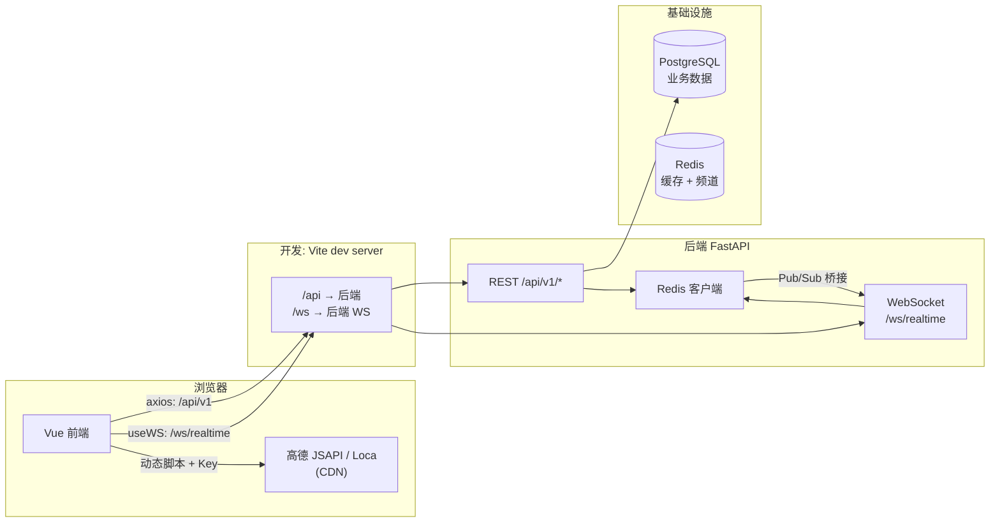

# COSCO GD 数据驾驶舱

面向广东、广西航运堆场/物流点位的地图中台驾驶舱，采用 **FastAPI + Vue3 + 高德地图 + ECharts**，支持地图与图表表格联动、实时告警与巡检轮播。

**常见坑（必读）：** 在 Conda 里即使显示 `(cosco-gd)`，若在终端里直接敲 `uvicorn` 或 `alembic`，仍可能用到 **本机其他 Python**（例如 Homebrew 的 3.13），从而出现 `**ModuleNotFoundError: sqlalchemy` 等**。请始终：

- 迁移：`python -m alembic upgrade head`
- 起服务：`python -m uvicorn ...` 或 `bash scripts/dev_server.sh`（在 `backend/` 下，且已 `conda activate cosco-gd`）

## 目录

- `backend/`: FastAPI、SQLAlchemy/asyncpg、PostGIS、Redis（缓存 + Pub/Sub）、WebSocket、APScheduler
- `frontend/`: Vue3、Pinia、Element Plus、DataV、ECharts、高德 JSAPI/Loca
- `deploy/`: Nginx 反向代理与启动脚本示例
- `[docker-compose.yml](docker-compose.yml)`: **开发环境 PostgreSQL(PostGIS) + Redis（推荐）**

---

## 基础设施：Docker 启动 Postgres 与 Redis（推荐）

后续开发**默认采用 Docker** 在本机拉起数据库与缓存，与 `[backend/.env.example](backend/.env.example)` 中的连接串一致。

```bash
# 仓库根目录
docker compose up -d

# 确认健康（可选）
docker compose ps

# 关闭
docker compose down
```


| 服务                   | 镜像                       | 端口     | 说明                                        |
| -------------------- | ------------------------ | ------ | ----------------------------------------- |
| PostgreSQL + PostGIS | `postgis/postgis:16-3.4` | `5432` | 库名 `cosco_gd`，用户/密码 `postgres`/`postgres` |
| Redis                | `redis:7-alpine`         | `6379` | 默认库 `0`                                   |


首次等待容器 `healthy` 后，在 **已激活 `cosco-gd` 环境** 的 `backend/` 下执行迁移：

```bash
cd backend && conda activate cosco-gd
cp .env.example .env   # 若尚未复制
python -m alembic upgrade head
```

迁移包含 `sys_dict` 系统字典表（省份、城市、堆场状态等）。若库已存在且未跑最新迁移，请执行 `python -m alembic upgrade head`；也可补种：`python scripts/seed_sys_dict.py`。

若出现 `Connection refused`：先确认 `docker compose ps` 中 db/redis 已启动，且 `backend/.env` 里 `DATABASE_URL` / `REDIS_URL` 指向 `localhost`（与映射端口一致）。

**本机自行安装 PostgreSQL / Redis** 亦可，需自建库 `cosco_gd` 并保证端口与 `.env` 一致；团队协同时**以 Docker 为准**，避免环境不一致。

---

## 数据流与组件交互

### 总体关系（浏览器视角）




### 前端 ↔ 后端

- **HTTP**：前端通过 `VITE_API_BASE`（默认 `/api/v1`）请求；开发环境下由 [Vite 代理](frontend/vite.config.ts) 转发到本机 `8000` 端口的后端。
- **WebSocket**：前端连接 `VITE_WS_BASE`（可留空）推导出的 `**/ws/realtime`**；同样经 Vite 代理到后端，用于告警等推送。
- **高德地图**：前端使用 `@amap/amap-jsapi-loader` 加载 **高德 CDN** 上的 JS，Key 来自 `VITE_AMAP_KEY`。**堆场经纬度、业务指标等不由高德回传**，均由自有后端接口提供；地图仅负责渲染与交互（点击、图层、飞线轨迹等）。

### 后端内部：Redis 与 Postgres


| 组件             | 作用                                                                                                                                                                                                      |
| -------------- | ------------------------------------------------------------------------------------------------------------------------------------------------------------------------------------------------------- |
| **PostgreSQL** | 持久化业务数据（见下表）。                                                                                                                                                                                           |
| **Redis**      | ① **读缓存**：部分 REST 结果 JSON 缓存（如按省份的堆场列表、KPI、吞吐趋势、货类分布）；② **Pub/Sub 频道 `cockpit.realtime`**：后端（或调度任务）发布消息，WebSocket 侧订阅后 **广播给所有在线大屏客户端**。Redis 不可用时：缓存读写会降级为空/不设缓存；实时链路依赖 Redis，需保证其可用（或后续改为进程内广播做单机演示）。 |


---

## Postgres 中存储的数据（当前模型）


| 表名                 | 用途                                                    |
| ------------------ | ----------------------------------------------------- |
| `yards`            | 堆场/点位主数据：名称、编码、省市、`lng`/`lat`、容量、状态，可选 PostGIS `geom` |
| `throughput_daily` | 按堆场、按日的进场/出场 TEU、库存等                                  |
| `cargo_category`   | 按堆场、货类维度的货量                                           |
| `alerts`           | 预警记录（级别、类型、文案、`yard_id`、时间）                           |
| `vehicles`         | 车辆在途等演示数据（起点终点堆场编码等）                                  |


> **说明**：接口 `GET /api/v1/flow/od`（OD 飞线）当前仍走 **内存 mock**，未落库；堆场详情里的部分字段（如今日进出）在 API 层有固定示例值，可与表数据进一步对齐。

---

## Redis 中存储的数据（当前用法）

- `**GET/SET` JSON 字符串**：键形如 `yards:all`、`yards:广东`、`kpi:overview`、`throughput:trend:7`、`cargo:distribution` 等，带 TTL（约 20–60 秒），用于减轻 Postgres 读压力。
- `**PUBLISH cockpit.realtime`**：发布 JSON 事件；后端 `pubsub` 协程订阅后通过 WebSocket 推给前端。调度器当前按间隔模拟告警 tick（生产可改为真实事件写入后再发布）。

---

## 上线后「真实数据」应从哪里来

建议将 **事实数据** 落在 **PostgreSQL**（或同一逻辑库），与本项目表结构对齐或渐进迁移：

1. **堆场主数据与地理信息**：来自港航/堆场主数据系统或 MDM；经 ETL、API 同步或运营后台录入；**经纬度**建议以业务系统或权威 GIS 为准，与高德底图一般为同一 WGS84/GCJ02 体系需在接口层约定一致。
2. **吞吐、库存、货类、车辆状态**：来自 TOS、WMS、车队/IoT 平台；可按日、按批写入 `throughput_daily`、`cargo_category`，或扩展事实表后由 API 聚合。
3. **告警**：规则引擎或监控系统产生写入 `alerts`；同时可向 Redis `cockpit.realtime` **发布**即时事件，驱动大屏无需轮询。
4. **OD 流量 / 飞线**：需新增事实表（例如按日 `from_yard_code` / `to_yard_code` / `teu`）或对接现有物流结算/路径数据；替换 `mock_flow()` 为真实查询。
5. **Redis**：生产环境继续用于 **接口缓存**（可调大 TTL、加前缀）与 **多实例 WebSocket 广播**；缓存失效策略需在数据变更时由写入方 `DEL` 相关 key 或接受短 TTL。
6. **高德 Key**：仍在浏览器端使用，在高德控制台配置 **域名白名单** 与合规的安全策略；服务端不向高德提交业务敏感明细，除非后续增加路线规划等服务端 API（需另配服务端 Key）。

---

## 开发启动（应用层）

### Backend

```bash
cd backend
cp .env.example .env
# 首次创建环境（仅需执行一次）
conda create -n cosco-gd python=3.11 -y
conda activate cosco-gd
pip install -e .
python -m alembic upgrade head
# 起服务（二选一，不要单独敲 `uvicorn`）
python -m uvicorn app.main:app --reload --host 0.0.0.0 --port 8000
# 或：bash scripts/dev_server.sh
```

初始化广东/广西种子数据：

```bash
python scripts/seed_gd_gx.py
```

### Frontend

```bash
cd frontend
cp .env.example .env
npm install
npm run dev
```

更多环境变量说明见 `[frontend/.env.example](frontend/.env.example)`。

**高德地址解析（数据管理台新增堆场）**：除 `VITE_AMAP_KEY` 外，若控制台启用了安全密钥，须配置 `VITE_AMAP_SECURITY`，否则 Geocoder 可能鉴权失败。

---

## 管理页面

| 路径 | 说明 |
|------|------|
| `/` | 数据驾驶舱（省份筛选来自 `sys_dict`） |
| `/data-console` | PostgreSQL 数据管理台：六张业务表 CRUD + CSV 导入；堆场支持「详细地址 → 解析坐标」并保留经纬度手填 |
| `/system-admin` | 系统管理：维护省份、城市、堆场类型/状态、货种、预警级别/类型、车辆状态等字典 |

驾驶舱地图区工具条可进入 **系统管理** / **数据管理**。当前管理接口**无登录鉴权**，仅适合内网或开发环境。

### 系统字典 API

- `GET /api/v1/sys-dict/types`
- `GET /api/v1/sys-dict?type=province&parent=&enabled_only=true`
- `POST /api/v1/sys-dict`、`PATCH /api/v1/sys-dict/{id}`、`DELETE /api/v1/sys-dict/{id}`

---

## 核心接口

- `GET /api/v1/yards?province=`
- `GET /api/v1/yards/{id}/detail`
- `GET /api/v1/kpi/overview`
- `GET /api/v1/throughput/trend?range=7d`
- `GET /api/v1/cargo/distribution`
- `GET /api/v1/ranking/yards?metric=teu&top=10`
- `GET /api/v1/alerts/recent`
- `GET /api/v1/flow/od`
- `GET /api/v1/data-console/*`（数据管理台）
- `GET /api/v1/sys-dict/*`（系统字典）
- `WS /ws/realtime`

---

## 交互特性

- 地图点位点击/悬浮提示与详细抽屉
- 图层切换：散点、热力、飞线、3D 柱
- 表格点击驱动地图飞行定位
- WebSocket 实时预警脉冲
- 空闲自动巡检轮播

---

## 生产部署

1. `frontend/` 执行 `npm run build`，将 `dist` 发布到 Nginx 静态目录
2. `backend/` 使用 `python -m uvicorn app.main:app --host 0.0.0.0 --port 8000 --workers 2` 等方式启动
3. 使用 `deploy/nginx.conf` 配置 `/api` 与 `/ws` 反代
4. **PostgreSQL（PostGIS）与 Redis** 使用托管服务或独立集群部署，连接串写入环境变量，**勿**将生产凭据提交到仓库

